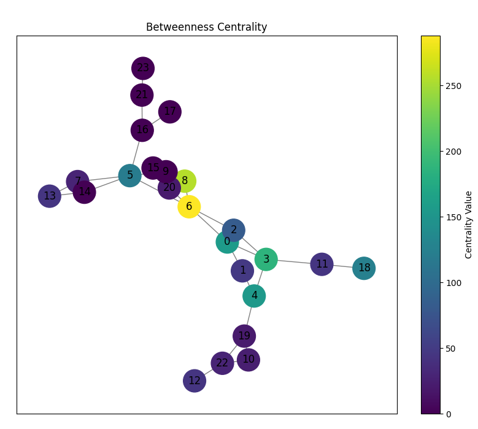
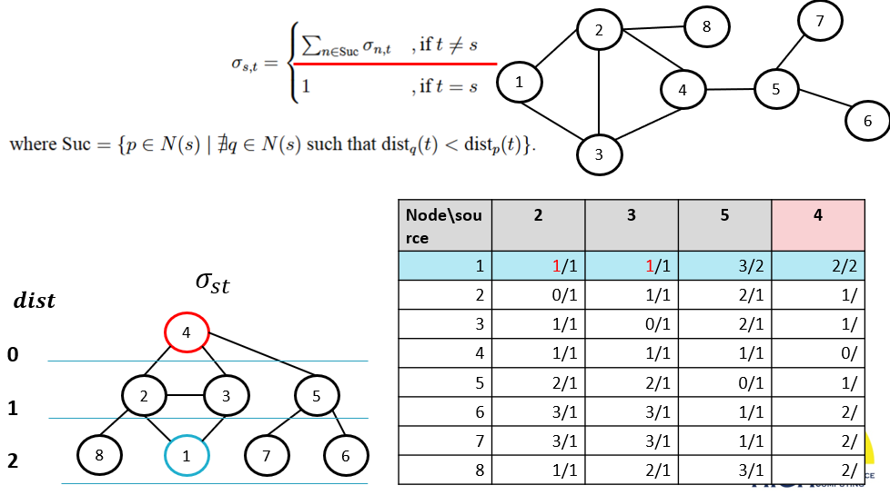
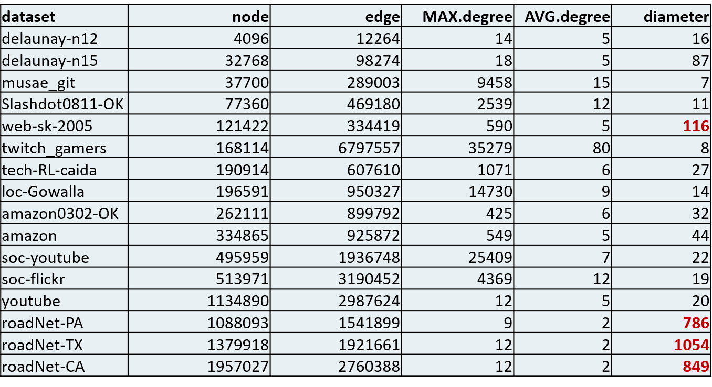

# Efficient Computation of Betweenness Centrality on Heterogeneous CPU/GPU Systems

## Introduction

Graph centrality measures assign a value to each vertex in a graph based on its position relative to others, identifying key nodes that can efficiently disseminate information. These measures are widely applied in domains such as biology, sociology, road networks, social networks, and transportation systems.

Among them, **Betweenness Centrality (BC)** is a fundamental metric. The BC value of a vertex $v$ reflects its importance as an intermediary on the shortest paths between other node pairs. A high $BC(v)$ means that $v$ lies on many shortest paths and thus plays a crucial role in facilitating communication or information flow. Conversely, a low $BC(v)$ indicates a peripheral role with minimal influence over connectivity.

Formally, it define as:     

  

where:

- $\sigma_{s,t}$ is the total number of shortest paths from vertex $s$ to vertex $t$,
- $\sigma_{s,t}(v)$ is the number of those paths that pass through vertex $v$,
- the summation is taken over all pairs $(s, t) \in V \times V$, such that $s \ne v \ne t$.

For example, in the figure below, vertex **6** has a high $BC(6)$ value because it lies on numerous shortest paths between other nodes. In contrast, other **purple** vertices have low BC values as they are not part of many shortest paths and are thus less central to network communication.

Our goal is to parallel BC computation especially on large and high diameter dataset on Heterogeneous CPU/GPU Systems.

  

## Proposed Method
This issue focused on All-Pair Shortest Path(APSP) problem, and recent research has proposed parallel Breathe-First Search(BFS)  algorithms for APSP on (Graphics Processing Unit)GPU. However, BFS is restricted by level, so we need to develope more parallable technique and relations to increase total scalablity on GPU.

In previous research, create Degree-1 folding, Articulation points, Side vertex .etc techniques to decrease computation load, but there is not low enough for large dataset. Therefore, I create two equation to help us to increase scalablity on GPU.

For a given unweighted and undirected graph $G = (V, E)$, we first define the distance function $\mathrm{dist}_s(t)$ as:

  

We then compute the number of shortest paths $\sigma_{s,t}$ recursively as:

  

 To use this relation, we first pick a vertex $s$ as the source and traverse all $n \in N(s)$ to obtain the corresponding paths and distances. Then, we can use the relation to get the distance and path from $s$ to other vertices $t$.

For example, when we know the \{n \in N(s)\} distance and path, we cen compute source $s$ distance and path parallelly.

  

  <em>Compute distance from source $s$ to all vertices</em>

  

  <em>Compute the number of shortest paths from source $s$</em>

More deatail you can search on BC.cu

## Experiment
This is my environment and dataset.

  <em>Environment</em>

  

  <em>Dataset</em>

  

  <em>Result</em>

  

there are more compared algorithm still running...

## Conclusion

The proposed algorithm demonstrates strong performance on large-scale, high-diameter datasets (e.g., road networks), while still yielding improvements across a wide range of dataset types.
